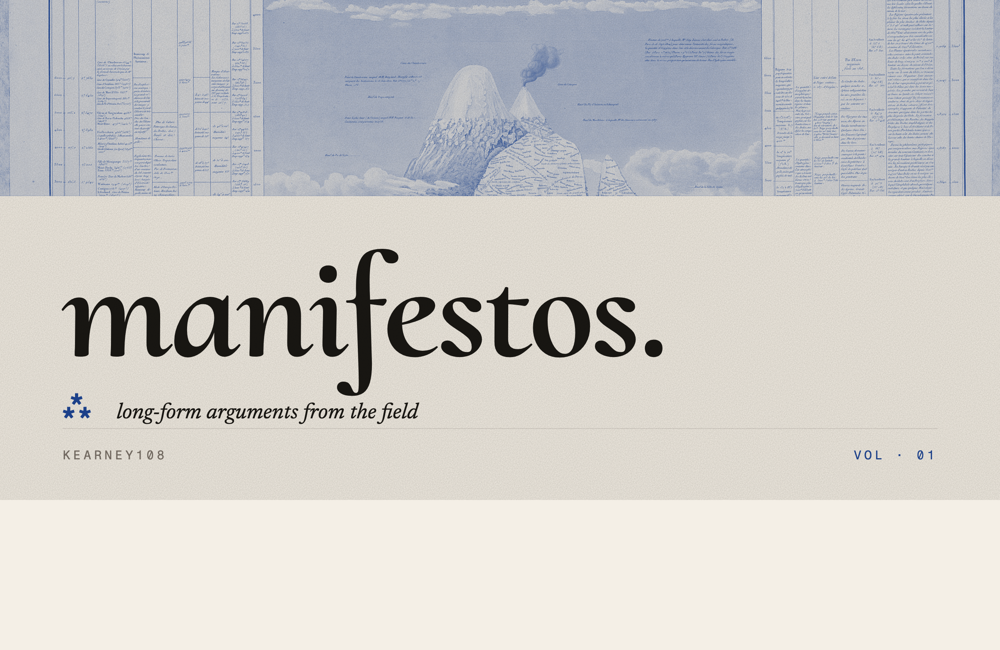

  

###                                                        ⁂ CURRENTLY ⁂

<!-- CURRENTLY:START -->
|  |  |
|---|---|
| **reading** | Humboldt — *Personal Narrative of Travels to the Equinoctial Regions of the New Continent* |
| **building** | a vibrato pedal with a bucket-brigade delay line |
| **digging** | Aldrovandi's *Monstrorum Historia*, 1642 edition |
<!-- CURRENTLY:END -->

### ⁂ THE PUBLICATION

<table>
  <tr>
    <td width="33%"></td>
    <td width="33%"></td>
    <td width="33%"></td>
  </tr>
  <tr>
    <td width="33%"></td>
    <td width="33%"></td>
    <td width="33%"></td>
  </tr>
</table>

`kearney108 · MAY · 2026 · 108`
