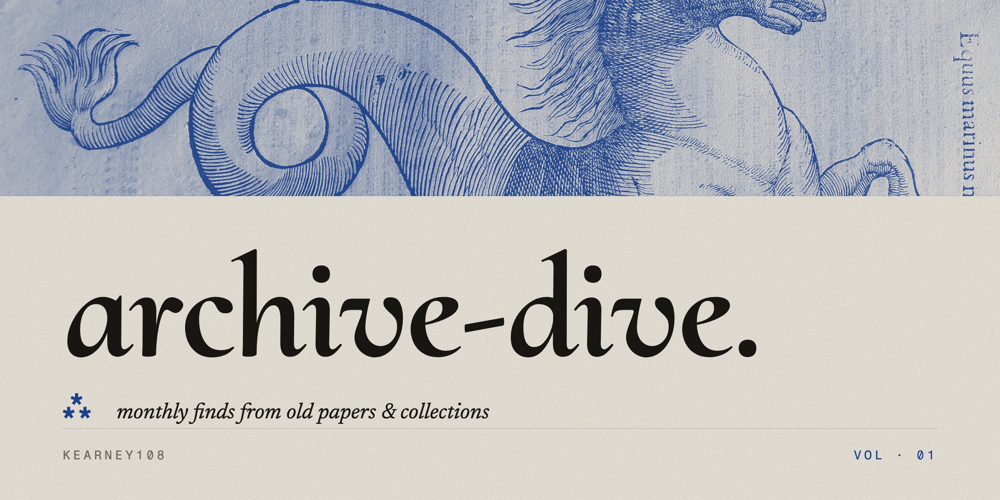
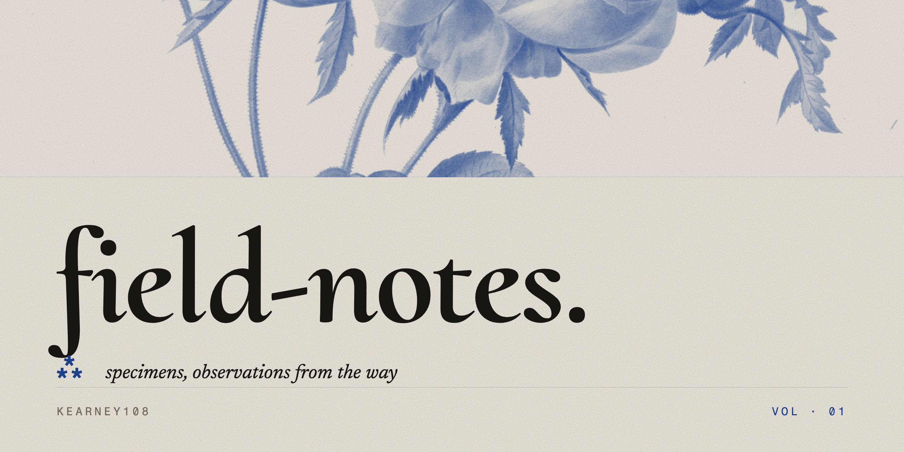
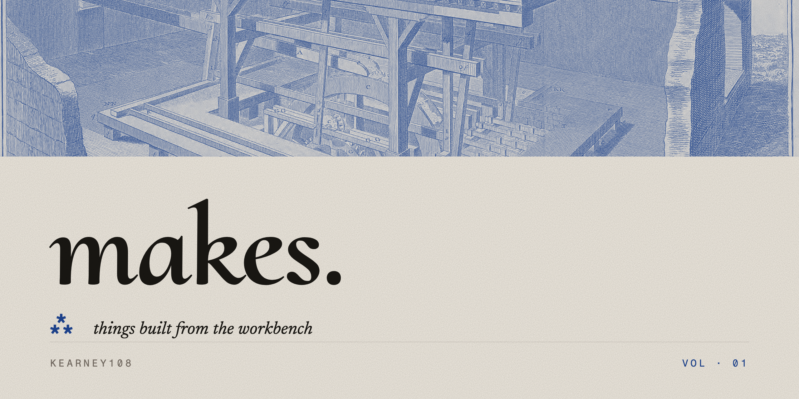
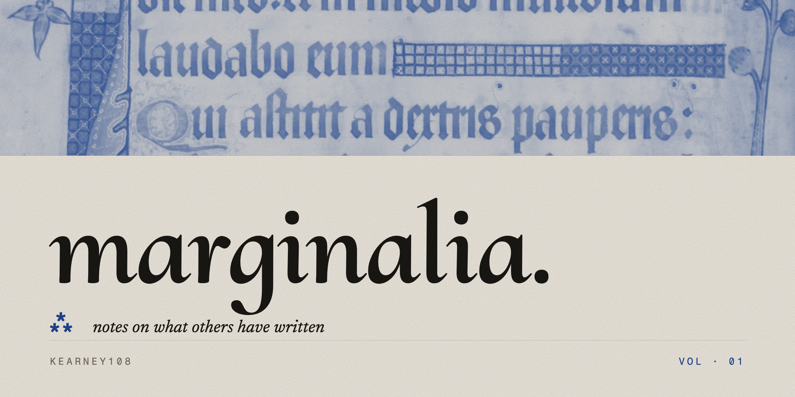
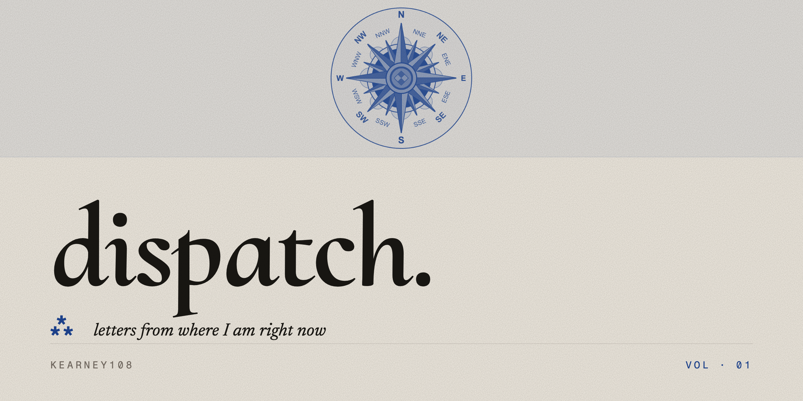

  

This is where I keep the things that matter to me — the un-careful version. Long-form arguments, monthly archive dives, field notes from where I am, marginalia from what I'm reading, and the things I keep building. Public, but not for anyone in particular.

  

### ⁂ CURRENTLY

<!-- CURRENTLY:START -->
|  |  |
|---|---|
| **reading** | Humboldt — *Personal Narrative of Travels to the Equinoctial Regions of the New Continent* |
| **building** | a vibrato pedal with a bucket-brigade delay line |
| **digging** | Aldrovandi's *Monstrorum Historia*, 1642 edition |
<!-- CURRENTLY:END -->

  

### ⁂ THE PUBLICATION

<table>
  <tr>
    <td width="33%"></td>
    <td width="33%"></td>
    <td width="33%"></td>
  </tr>
  <tr>
    <td width="33%"></td>
    <td width="33%"></td>
    <td width="33%"></td>
  </tr>
</table>

  

  

  

`kearney108 · MAY · 2026 · 108`
