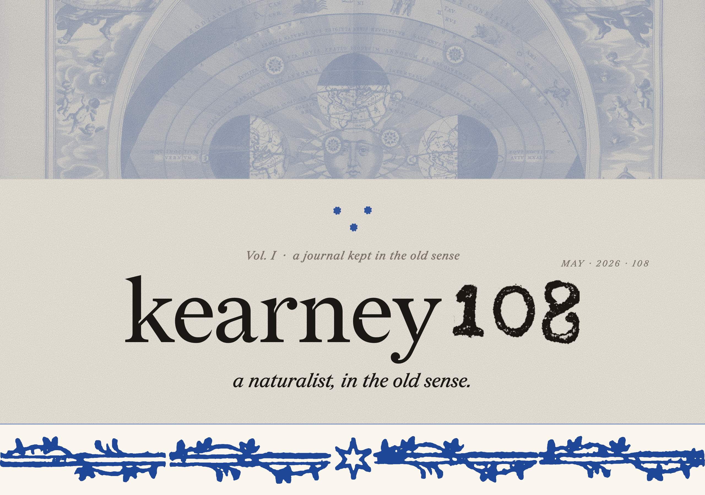

  

This is where I keep the things that matter to me — the un-careful version. Long-form arguments, monthly archive dives, field notes from where I am, marginalia from what I'm reading, and the things I keep building. Public, but not for anyone in particular.

⁂

### ⁂ CURRENTLY

<!-- CURRENTLY:START -->
|  |  |
|---|---|
| **reading** | Humboldt — *Personal Narrative of Travels to the Equinoctial Regions of the New Continent* |
| **building** | a vibrato pedal with a bucket-brigade delay line |
| **digging** | Aldrovandi's *Monstrorum Historia*, 1642 edition |
<!-- CURRENTLY:END -->

⁂

### ⁂ THE PUBLICATION

|  |  |
|:---|:---|
| **manifestos.** | *long-form arguments from the field* |
| **archive-dive.** | *monthly finds from old papers &amp; collections* |
| **field-notes.** | *specimens, observations from the way* |
| **makes.** | *things built from the workbench* |
| **marginalia.** | *notes on what others have written* |
| **dispatch.** | *letters from where I am right now* |

*coming online — sections appear here as they go up.*

⁂

`kearney108 · MAY · 2026 · 108`
